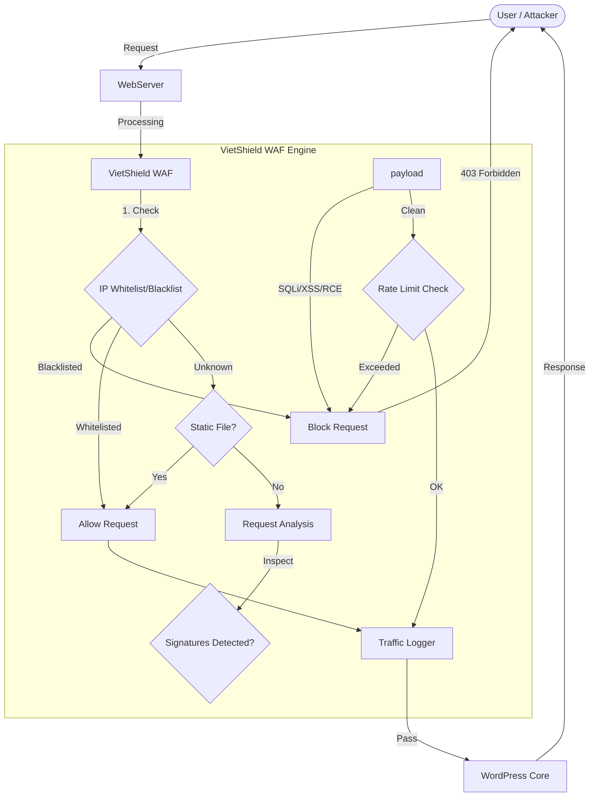

# VietShield WAF

**Contributors:** vietshield  
**Tags:** security, firewall, waf, malware, protection  
**Requires at least:** 5.0  
**Tested up to:** 6.9  
**Stable tag:** 1.0.2  
**Requires PHP:** 7.4  
**License:** GPLv2 or later  
**License URI:** https://www.gnu.org/licenses/gpl-2.0.html

High-performance Web Application Firewall for WordPress with real-time threat detection and blocking.

**Version:** 1.0.2  
**Web:** [https://vietshield.org](https://vietshield.org)  
**Recommended Webserver:** Nginx/Openresty

## 🏗️ Architecture & Operation Model

VietShield WAF intercepts requests early in the WordPress loading process to filter malicious traffic before it reaches your site's core functions.

1.  **Early Interception**: The WAF initializes before most WordPress plugins to catch threats early.
2.  **IP Filtering**: Checks headers against local databases of trusted and banned IPs.
3.  **Static Bypass**: Automatically skips analysis for static assets (images, css, js) to ensure strictly zero latency.
4.  **Deep Analysis**: Scans GET, POST, and COOKIE data against a comprehensive rule set.
5.  **Logging**: Records traffic details and metadata asynchronously to prevent performance bottlenecks.

---

## � Installation

1.  Download the latest release ZIP file from the [Releases page](https://github.com/VietShield-Security/VietShield-WAF/releases).
2.  Go to your WordPress Admin Dashboard > **Plugins** > **Add New** > **Upload Plugin**.
3.  Upload the `vietshield-waf.zip` file and click **Install Now**.
4.  **Activate** the plugin.
5.  Follow the **Setup Wizard** to configure basic protection settings.
6.  Go to **VietShield WAF > Settings** to fine-tune your configuration.

---

## ✨ Features & Usage

### 1. Advanced Web Application Firewall
Core protection engine that blocks malicious requests in real-time.
*   **Protection Types**:
    *   **SQL Injection (SQLi)**: Blocks UNION SELECT, time-based, and error-based attacks.
    *   **Cross-Site Scripting (XSS)**: Prevents script injection.
    *   **Remote Code Execution (RCE) / LFI**: Stops shell command execution and path traversal.
    *   **Bad Bots & Scanners**: Automatically identifies and blocks automated tools like SQLMap, Nikto, Nuclei.
*   **Usage**: Go to **Settings > Protection Settings** to toggle specific protections. You can also switch between **Learning Mode** (log only) and **Protecting Mode** (active blocking).

### 2. Live Traffic & Analytics
Monitor who is visiting your site with zero latency.
*   **Real-time Monitoring**: Watch requests hitting your site live.
*   **Detailed Metadata**: View IP Country, ASN (ISP), and specific Attack Details (Rule ID, Payload).
*   **Usage**: Visit **Live Traffic** to see the logs. Click "Block" on any suspicious request to instantly ban that IP. Filter logs by "Blocked" to analyze attacks.

### 3. IP Management & Firewall
Manage access control lists and automated blocking rules.
*   **Lists**:
    *   **Whitelist**: Trusted IPs (e.g., admins, payment gateways) that bypass WAF checks.
    *   **Blacklist**: Permanently blocked malicious IPs.
    *   **Temporary Blocks**: IPs automatically banned by rate limiting or brute-force rules (auto-released after configured duration).
*   **Geo-Blocking**: Block traffic from specific high-risk countries.
*   **Usage**: Go to **Firewall** to manage lists manually. Configure **Auto Block Threshold** in Settings to define when an attacker gets temporarily banned.

### 4. Threat Intelligence
Leverage community data to preemptively block threats.
*   **Community Feed**: Syncs valid threat data from the VietShield Network (1-day, 7-day, or 30-day categories).
*   **Auto-Whitelist**:
    *   **Googlebot**: Automatically validates and whitelists real Google crawlers daily.
    *   **Cloudflare**: Built-in support for Cloudflare's IP ranges.
*   **Usage**: Enable in **Settings > Threat Intelligence**.

### 5. Malware & Integrity Scanner
Ensure your site's files haven't been tampered with.
*   **WP Core Scanner**: Verifies system files against the official WordPress repository.
*   **Malware Scanner**: Scans themes and plugins for suspicious code (backdoors, shells, eval functions).
*   **Usage**: Run manual scans via the **File Scanner** and **Malware Scanner** tabs, or configure daily/weekly schedules in Settings.

### 6. Login Security
Protect your dashboard from unauthorized access.
*   **Brute Force Protection**: Limits failed login attempts per IP.
*   **Smart Lockout**: Temporarily bans IPs after X failed attempts.
*   **Honeypot**: Invisible fields to trap bots.
*   **Author Enumeration**: Blocks attempts to fish for usernames.
*   **Usage**: Configure thresholds and email notifications in **Login Security** settings.

---

## 🌐 External Services

This plugin relies on the following third-party services to provide enhanced security features. All external connections are documented below:

### 1. VietShield Intelligence Network
*   **Service:** Threat Intelligence Feed
*   **Why we use it:** To synchronize the latest list of known malicious IPs (e.g., spammers, botnets) for preemptive blocking.
*   **Data Sent:** Your server's IP address (standard HTTP request) and API authentication headers. No personal user data is sent.
*   **Link:** [VietShield Intelligence](https://intelligence.vietshield.org)
*   **Terms & Privacy:** [Privacy Policy](https://vietshield.org/privacy)

### 2. Google
*   **Service:** Googlebot IP Ranges
*   **Why we use it:** To fetch the official list of Googlebot IP addresses for whitelisting, preventing accidental blocking of search crawlers.
*   **Data Sent:** None (Public JSON feed fetch).
*   **Link:** [Google Search Central](https://developers.google.com/search/apis/ipranges/googlebot.json)
*   **Terms & Privacy:** [Google Privacy Policy](https://policies.google.com/privacy)

### 3. Cloudflare
*   **Service:** Cloudflare IP Ranges
*   **Why we use it:** To fetch official Cloudflare IP ranges to trust headers from Cloudflare proxy servers.
*   **Data Sent:** None (Public text/JSON feed fetch).
*   **Link:** [Cloudflare IP Ranges](https://www.cloudflare.com/ips/)
*   **Terms & Privacy:** [Cloudflare Privacy Policy](https://www.cloudflare.com/privacypolicy/)

---

## ❓ FAQ

**Q: Will this slow down my site?**  
A: No. VietShield is optimized for performance. It uses intelligent bypass for static files and executes heavy logging tasks in the background.

**Q: I blocked myself! What do I do?**  
A: You can manually remove your IP from the `vietshield_ip_lists` database table, or rename the plugin folder via FTP to temporarily disable it.

---

**VietShield WAF** - Protected by Vietnam's Leading Security Experts.
