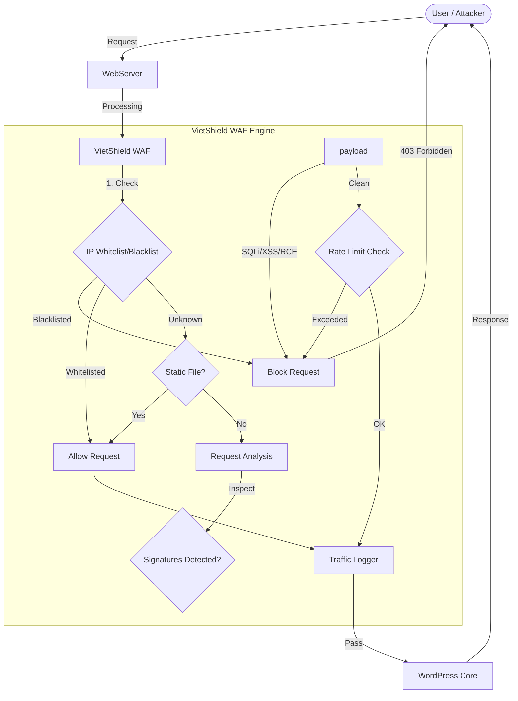

# VietShield WAF

**Contributors:** vietshield  
**Tags:** security, firewall, waf, malware, protection  
**Requires at least:** 5.0  
**Tested up to:** 6.9  
**Stable tag:** 1.1.2
**Requires PHP:** 7.4
**License:** GPLv2 or later
**License URI:** https://www.gnu.org/licenses/gpl-2.0.html

High-performance Web Application Firewall for WordPress with real-time threat detection and blocking.

**Version:** 1.1.2
**Web:** [https://vietshield.org](https://vietshield.org)  
**Recommended Webserver:** Nginx/Openresty

## 🏗️ Architecture & Operation Model

VietShield WAF intercepts requests early in the WordPress loading process to filter malicious traffic before it reaches your site's core functions.

```mermaid
graph TD
    User([User / Attacker]) -->|Request| WebServer
    WebServer -->|Processing| Plugin[VietShield WAF]
    
    subgraph "VietShield WAF Engine"
        Plugin -->|1. Check| IPCheck{IP Whitelist/Blacklist}
        IPCheck -- Blacklisted --> BlockAction[Block Request]
        IPCheck -- Whitelisted --> AllowAction[Allow Request]
        IPCheck -- Unknown --> StaticCheck{Static File?}
        
        StaticCheck -- Yes --> AllowAction
        StaticCheck -- No --> WAFAnalysis
        
        WAFAnalysis[Request Analysis] -->|Inspect| Payload{Signatures Detected?}
        payload -->|SQLi/XSS/RCE| BlockAction
        payload -->|Clean| RateLimit{Rate Limit Check}
        
        RateLimit -- Exceeded --> BlockAction
        RateLimit -- OK --> Logger[Traffic Logger]
    end
    
    AllowAction --> Logger
    BlockAction -->|403 Forbidden| User
    Logger -->|Pass| WordPress[WordPress Core]
    WordPress -->|Response| User
```

1.  **Early Interception**: The WAF initializes before most WordPress plugins to catch threats early.
2.  **IP Filtering**: Checks headers against local databases of trusted and banned IPs.
3.  **Static Bypass**: Automatically skips analysis for static assets (images, css, js) to ensure strictly zero latency.
4.  **Deep Analysis**: Scans GET, POST, and COOKIE data against a comprehensive rule set.
5.  **Logging**: Records traffic details and metadata asynchronously to prevent performance bottlenecks.

---

## 📦 Installation

1.  Download the latest release ZIP file from the [Releases page](https://github.com/VietShield-Security/VietShield-WAF/releases).
2.  Go to your WordPress Admin Dashboard > **Plugins** > **Add New** > **Upload Plugin**.
3.  Upload the `vietshield-waf.zip` file and click **Install Now**.
4.  **Activate** the plugin.
5.  Follow the **Setup Wizard** to configure basic protection settings.
6.  Go to **VietShield WAF > Settings** to fine-tune your configuration.

---

## ✨ Features & Usage

### 1. Advanced Web Application Firewall
Core protection engine that blocks malicious requests in real-time.
*   **Protection Types**:
    *   **SQL Injection (SQLi)**: Blocks UNION SELECT, time-based, and error-based attacks.
    *   **Cross-Site Scripting (XSS)**: Prevents script injection.
    *   **Remote Code Execution (RCE) / LFI**: Stops shell command execution and path traversal.
    *   **Bad Bots & Scanners**: Automatically identifies and blocks automated tools like SQLMap, Nikto, Nuclei.
*   **Usage**: Go to **Settings > Protection Settings** to toggle specific protections. You can also switch between **Learning Mode** (log only) and **Protecting Mode** (active blocking).

### 2. Live Traffic & Analytics
Monitor who is visiting your site with zero latency.
*   **Real-time Monitoring**: Watch requests hitting your site live.
*   **Detailed Metadata**: View IP Country, ASN (ISP), and specific Attack Details (Rule ID, Payload).
*   **Usage**: Visit **Live Traffic** to see the logs. Click "Block" on any suspicious request to instantly ban that IP. Filter logs by "Blocked" to analyze attacks.

### 3. IP Management & Firewall
Manage access control lists and automated blocking rules.
*   **Lists**:
    *   **Whitelist**: Trusted IPs (e.g., admins, payment gateways) that bypass WAF checks.
    *   **Blacklist**: Permanently blocked malicious IPs.
    *   **Temporary Blocks**: IPs automatically banned by rate limiting or brute-force rules (auto-released after configured duration).
*   **Geo-Blocking**: Block traffic from specific high-risk countries.
*   **Usage**: Go to **Firewall** to manage lists manually. Configure **Auto Block Threshold** in Settings to define when an attacker gets temporarily banned.

### 4. Threat Intelligence
Leverage community data to preemptively block threats.
*   **Community Feed**: Syncs valid threat data from the VietShield Network (1-day, 7-day, or 30-day categories).
*   **Auto-Whitelist**:
    *   **Googlebot**: Automatically validates and whitelists real Google crawlers daily.
    *   **Cloudflare**: Built-in support for Cloudflare's IP ranges.
*   **Usage**: Enable in **Settings > Threat Intelligence**.

### 5. Malware & Integrity Scanner
Ensure your site's files haven't been tampered with.
*   **WP Core Scanner**: Verifies system files against the official WordPress repository.
*   **Malware Scanner**: Scans themes and plugins for suspicious code (backdoors, shells, eval functions).
*   **Usage**: Run manual scans via the **File Scanner** and **Malware Scanner** tabs, or configure daily/weekly schedules in Settings.

### 6. Login Security
Protect your dashboard from unauthorized access.
*   **Brute Force Protection**: Limits failed login attempts per IP.
*   **Smart Lockout**: Temporarily bans IPs after X failed attempts.
*   **Honeypot**: Invisible fields to trap bots.
*   **Author Enumeration**: Blocks attempts to fish for usernames.
*   **Usage**: Configure thresholds and email notifications in **Login Security** settings.

### 7. Hide Admin Login
Hide the default WordPress login page to prevent automated attacks.
*   **Custom Login URL**: Replace `/wp-login.php` and `/wp-admin` with a custom slug (e.g., `/my-secret-login`).
*   **403 Block Page**: Unauthorized access to default login URLs returns a styled 403 Forbidden page with cached static HTML for performance.
*   **Smart Exclusions**: Automatically allows `admin-ajax.php`, `admin-post.php`, REST API, WP Cron, and XML-RPC.
*   **Usage**: Enable in **Settings > Login Security > Hide Admin Login**, set your custom slug, and save.

### 8. Admin Access Control
Control which administrator accounts can access the WordPress admin dashboard.
*   **Authorized Admins Only**: Select specific admin accounts that are allowed to access the dashboard.
*   **Anti-Exploit Protection**: Even if a hacker creates an admin account via exploit, they cannot access admin unless explicitly authorized.
*   **Capability Restriction**: Unauthorized admins have sensitive capabilities removed (install plugins, edit users, manage options, etc.).
*   **Self-Lock Prevention**: Your own account is always included to prevent accidental lockout.
*   **Usage**: Enable in **Settings > Login Security > Admin Access Control**, select authorized admins, and save.

---

## 🌐 External Services

This plugin relies on the following third-party services to provide enhanced security features. All external connections are documented below:

### 1. VietShield Intelligence Network
*   **Service:** Threat Intelligence Feed
*   **Why we use it:** To synchronize the latest list of known malicious IPs (e.g., spammers, botnets) for preemptive blocking.
*   **Data Sent:** Your server's IP address (standard HTTP request) and API authentication headers. No personal user data is sent.
*   **Link:** [VietShield Intelligence](https://intelligence.vietshield.org)
*   **Terms & Privacy:** [Privacy Policy](https://vietshield.org/privacy)

### 2. Google
*   **Service:** Googlebot IP Ranges
*   **Why we use it:** To fetch the official list of Googlebot IP addresses for whitelisting, preventing accidental blocking of search crawlers.
*   **Data Sent:** None (Public JSON feed fetch).
*   **Link:** [Google Search Central](https://developers.google.com/search/apis/ipranges/googlebot.json)
*   **Terms & Privacy:** [Google Privacy Policy](https://policies.google.com/privacy)

### 3. Cloudflare
*   **Service:** Cloudflare IP Ranges
*   **Why we use it:** To fetch official Cloudflare IP ranges to trust headers from Cloudflare proxy servers.
*   **Data Sent:** None (Public text/JSON feed fetch).
*   **Link:** [Cloudflare IP Ranges](https://www.cloudflare.com/ips/)
*   **Terms & Privacy:** [Cloudflare Privacy Policy](https://www.cloudflare.com/privacypolicy/)

---

## ❓ Frequently Asked Questions

### Is VietShield WAF safe and malware-free?
Absolutely. VietShield is 100% open-source and transparent. You can inspect every line of code on our [GitHub Repository](https://github.com/VietShield-Security/VietShield-WAF) to verify it's clean and secure. No hidden code, no backdoors.

### Will this slow down my website?
No. VietShield is optimized for zero latency. It uses intelligent bypass for static files (images, CSS, JS) and executes heavy logging tasks asynchronously in the background. Your visitors experience no delay.

### I accidentally blocked myself! How do I get back in?
Don't panic. You have two options:
1. Manually remove your IP from the `vietshield_ip_lists` database table using phpMyAdmin
2. Rename the `vietshield-waf` plugin folder via FTP/File Manager to temporarily disable the firewall

### What's the difference between Learning Mode and Protecting Mode?
**Learning Mode** logs threats without blocking them - perfect for testing and fine-tuning rules. **Protecting Mode** actively blocks detected threats. Start with Learning Mode to avoid false positives, then switch to Protecting Mode once configured.

### Is VietShield compatible with other security plugins?
Yes, but we recommend using VietShield as your primary WAF. It works alongside backup plugins, but avoid running multiple WAFs simultaneously as they may conflict. VietShield provides comprehensive protection that typically replaces the need for other security plugins.

### How does the Threat Intelligence feature work?
VietShield syncs with our community threat network to receive real-time IP blacklists. You can choose 1-day, 7-day, or 30-day feeds. We also auto-whitelist legitimate crawlers like Googlebot and Cloudflare IPs to prevent false positives.

### I forgot my custom login URL! How do I log in?
If you enabled Hide Admin Login and forgot your custom slug, you can:
1. Access your database via phpMyAdmin, find the `wp_options` table, look for `vietshield_options`, and change `hide_login_enabled` to `false`
2. Rename the `vietshield-waf` plugin folder via FTP/File Manager to temporarily disable the plugin

### Where can I get support if I need help?
You can get support through our [GitHub Issues](https://github.com/VietShield-Security/VietShield-WAF/issues) page or email us at [support@vietshield.org](mailto:support@vietshield.org). Our community and team are active in helping users configure and optimize their security.

---

## 📝 Changelog

### Version 1.1.2 (2026-04-27)
**Improvements:**
- Core integrity scanner: clearer zoning and machine-readable reason codes for modified/unknown core files
- Malware scanner: staged checks (baseline hash reuse, lighter prefilter before deep signatures), unified risk scoring and severity mapping
- Database schema bump for new scanner metadata fields; automatic upgrade on plugin load
- Scanner admin UI: optional columns for zone, reason, and risk score; malware scope can include mu-plugins
- Autoloader: `MalwareScanner` registered for consistent class loading

### Version 1.1.1 (2026-03-18)
**New Features:**
- Hide Admin Login: Replace default `/wp-login.php` and `/wp-admin` with a custom login URL slug, unauthorized access returns 403 Forbidden
- Admin Access Control: Restrict which administrator accounts can access the WordPress admin dashboard, preventing unauthorized admin accounts (e.g., created by exploits) from accessing admin
- Block page caching: 403 block pages are cached as static HTML files per IP per day, subsequent requests serve the cached file directly for better performance

**Improvements:**
- Block page cache auto-cleanup via daily cron job
- Safety check: current user is always included in authorized admins list to prevent self-lockout
- Reserved WordPress slugs (wp-admin, login, admin, etc.) are blocked from being used as custom login slug

### Version 1.1.0 (2026-03-14)
**New Features:**
- URL Whitelist: bypass WAF checks for specific URL paths with exact match (`/my-page/`) and wildcard support (`/api/*`)

**Improvements:**
- Renamed "Manual IP Lists" section to "Custom Whitelist" for clarity

### Version 1.0.9 (2026-03-10)
**Critical Fixes:**
- Fixed 500 error when early blocker writes `.user.ini` before blocker file exists
- Fixed IP spoofing vulnerability in WAF engine, login security, and rate limiter
- Fixed race condition in rate limiter with atomic database operations
- Fixed IPv6 CIDR matching for non-4-bit-aligned prefix lengths
- Fixed XSS vulnerability in admin AJAX notice rendering
- Fixed open redirect in CAPTCHA handler via unvalidated `original_uri`
- Fixed threat intelligence feed data validation before TRUNCATE (prevents empty table on bad data)

**Bug Fixes:**
- Fixed brute force time window using wrong multiplier (`max_attempts*2` instead of configurable window)
- Fixed transient cleanup query deleting wrong entries
- Fixed `wp_cache_flush()` clearing entire object cache on every blocked request
- Fixed cron jobs rescheduling on every page load
- Fixed email notification flooding on repeated login failures
- Fixed Cloudflare IP sync overwriting manual trusted proxy entries
- Fixed wizard page too narrow and other plugin notices overlapping
- Fixed dead code in firewall mode switching and `whitelist_admins` not persisting

**Improvements:**
- Hide other plugins' admin notices on all VietShield pages
- Early blocker file existence check before enabling `auto_prepend_file`
- Improved uninstall cleanup (missing cron hooks, transients, options, blocker files)

### Version 1.0.8 (2026-03-09)
**UI/UX Improvements:**
- **Complete UI Redesign**: New design system with CSS custom properties, modern gradients, glassmorphism effects
- Header: gradient `#0f172a → #1e293b → #312e81` with decorative radial overlays
- Cards: 14px border-radius, hover shadow elevation, improved typography
- Tables: separated borders, rounded headers, indigo-tinted hover rows
- Badges: pill-style with subtle borders for attack types, severity, and actions
- Buttons: gradient primary buttons with hover lift effect
- Modals: backdrop blur, slide-in animation, 20px border-radius
- Responsive: optimized 2-col stats on tablet, 1-col on mobile

**New Features:**
- **In-page Plugin Update**: Check for updates, view version info, confirm before updating, success congratulations modal after reload
- **Retry Failed Threats**: Button to retry failed IP submissions in Threats Sharing queue

**Bug Fixes:**
- Fixed Threats Sharing `submit_queue()` logic: IPs silently accepted by API were incorrectly marked as failed (inverted success check to use failed list instead)
- Fixed footer simplified to single line with tagline

### Version 1.0.7 (2026-01-30)
**New Features:**
- **Googlebot Whitelist Card**: New dedicated card in Firewall page showing Googlebot sync status
  - Shows count of synced IP ranges (~1500-2000 IPs)
  - "Sync Now" button for manual sync from Google's official JSON endpoints
  - Show/Hide toggle to view Googlebot IPs in whitelist table

**UI/UX Improvements:**
- **Redesigned Setup Wizard**: Simplified from 3 steps to 2 steps (Choose Mode → Activate)
  - Removed Web Server Detection step (now uses `.user.ini` automatically)
  - Added professional progress bar animation during activation
  - Modern card-based mode selection UI
  - Shows "10 Features Enabled" status on completion
- **Settings Page Reorganization**: Better card groupings for improved UX
  - Attack Types now inside CAPTCHA Challenge card
  - Separate File Scanner and Malware Scanner cards
  - Country Blocking moved to Firewall tab
  - Fixed Plugin Information icon size/alignment in About tab (48x48px)

**Bug Fixes:**
- Fixed `whitelist_googlebot` option not being saved in Settings (missing from sanitization)
- Fixed wizard AJAX action name mismatch causing wizard to hang at 100%
- Fixed "vietshieldWizard is not defined" JavaScript error in wizard
- Fixed duplicate "Recommended" text in wizard mode selection
- Added nonce fallback for wizard AJAX calls
- Fixed Threat Intelligence not syncing after wizard completion
- Fixed Learning Mode selection being lost when navigating to step 2 (now single-page flow)

### Version 1.0.6 (2026-01-30)
**Bug Fixes:**
- Fixed translation warning `_load_textdomain_just_in_time` on block page by using dynamic message instead of `__()` function
- Fixed CAPTCHA challenge not triggering for some attack types by changing default behavior to apply captcha to ALL attack types except explicitly excluded ones (threat_intelligence, ip_blacklist, auto_blocked, temp_block)
- Block page now displays specific attack message instead of hardcoded translation

### Version 1.0.5 (2026-01-30)
**New Features:**
- **Auto-Update from GitHub Releases**: Plugin now supports automatic updates from GitHub
  - Checks for new releases every 12 hours
  - Shows update notification in WordPress admin
  - "View Details" popup shows changelog from GitHub release
  - One-click update directly from Plugins page

### Version 1.0.4 (2026-01-30)
**New Features:**
- **CAPTCHA Challenge**: Optional CAPTCHA verification instead of blocking for suspicious requests
  - Supports Google reCAPTCHA v2/v3, Cloudflare Turnstile, and hCaptcha
  - Configurable session duration after successful verification
  - Threat Intelligence blocks are excluded (always block, never captcha)
  - Professional challenge page with responsive design
- **Country Blocking Mode**: New "Allow Selected Countries Only" option
  - Choose between "Block Selected Countries" or "Allow Selected Countries Only" modes
  - Warning message when "Allow Selected" mode has no countries selected
  - Dynamic label updates in settings UI

**Improvements:**
- RCE protection now defaults to OFF in setup wizard to prevent false positives
- Wizard z-index set to 9985 to prevent notification overlapping while staying below WP admin menu
- Standardized attack_type to 'threat_intelligence' across all code (backward compatible with old 'threat_intel' values)
- Added CSS styling for threat_intelligence attack type badge

### Version 1.0.3 (2026-01-29)
**Bug Fixes:**
- Fixed wizard setup 403 Forbidden error at step 3 when completing setup
- Fixed nonce verification mismatch in wizard AJAX handlers
- Fixed RCE false positives with marketing/tracking parameters (e.g., `typ=organic|||src=google|||id=(none)`)
- Fixed block page CSS styling issues for responsive design
- Fixed country_block attack type being incorrectly synced to Threats Sharing API

**Improvements:**
- Wizard "Complete Setup" button now works correctly
- Enhanced RCE whitelist patterns to support `|||` delimiter format used by marketing tracking
- Improved advanced injection detection patterns to avoid matching marketing parameters
- Increased default Global Rate Limit from 100 to 250 requests per minute
- Professional redesigned 403 block page with glassmorphism, animations, and accessibility

### Version 1.0.2 (2026-01-21)
**New Features & Improvements:**
- Smart Timezone Sync: Removed manual timezone configuration. The WAF now automatically synchronizes with your WordPress timezone settings for accurate logging.
- Cloudflare Integration: Added native support for Cloudflare Trusted Proxies. The WAF automatically fetches and trusts Cloudflare IP ranges to prevent false positives when behind their proxy.
- Automated Whitelist Updates: Implemented daily automated synchronization for Googlebot IP ranges and Cloudflare IPs to ensure your whitelist is always up-to-date.
- Attack Type Classification: Enhanced Early Blocker to intelligently assign attack types based on block reasons, improving log accuracy.

**Bug Fixes:**
- Persistent Block IDs: Fixed issue where Block IDs were regenerating on every reload.
- Threat Sharing Sync: Fixed critical issue where IPs blocked by High-Performance Early Blocker were not being synced to the Threat Sharing API.
- Block Labeling: Fixed incorrect display of "TEMP_BLOCK" for permanently blacklisted IPs.
- Timezone Consistency: Fixed double timezone conversion issues in Live Traffic and Login Security views.
- Login Security Logging: Fixed an issue where login attempts were stored in local time, causing incorrect timestamps.

### Version 1.0.1 (2026-01-20)
**Bug Fixes:**
- Dashboard z-index: Fixed issue where other plugin notifications were overlapping VietShield WAF dashboard.
- Live Traffic Block ID: Fixed empty Block ID when visitor is blocked with Brute Force attack type.
- Attack Type Filter: Added missing attack types to Live Traffic filter dropdown.
- Threats Sharing: Fixed issue where brute force attacks were not being queued for submission to Intelligence API.
- Metadata Retrieval: Improved IP metadata retrieval when queueing threats.
- RCE Whitelist Sanitization: Fixed TypeError when saving RCE whitelist patterns.

**Improvements:**
- RCE Rule Default: Remote Code Execution (RCE) protection is now OFF by default to prevent false positives with Google Ads.
- RCE Whitelist Management: Added comprehensive regex-based whitelist system for RCE rules.
- RCE Detection Enhancement: Improved RCE detection to check whitelist patterns before blocking.
- Threats Sharing Metadata: Enhanced metadata enrichment for threat IPs.
- CSS Styling: Added CSS styles for new attack types in Live Traffic view.

### Version 1.0.0 (2026-01-16)
- Initial release
- Advanced WAF engine with SQLi, XSS, RCE, LFI protection
- Live Traffic & Analytics
- IP Management & Firewall (Whitelist, Blacklist, Geo-Blocking)
- Threat Intelligence integration
- Malware & Integrity Scanner
- Login Security with Brute Force Protection

---

**VietShield WAF** - Protected by Vietnam's Leading Security Experts.
